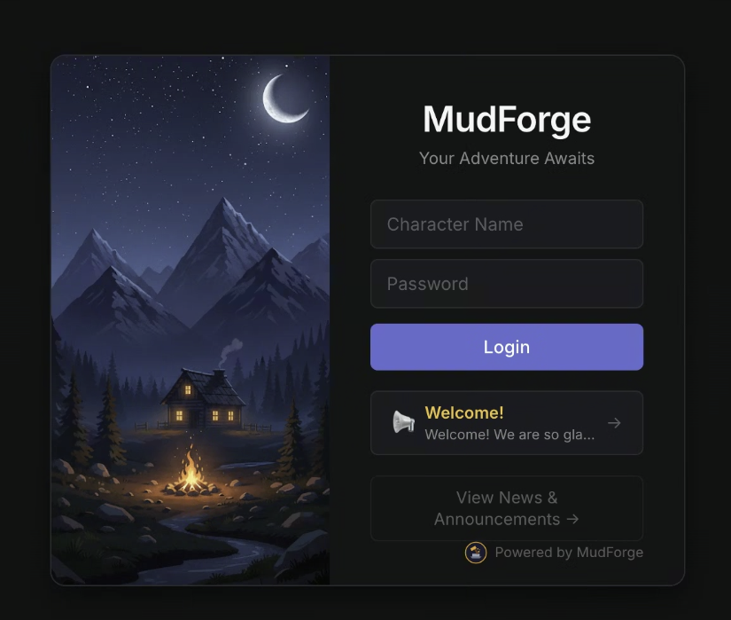
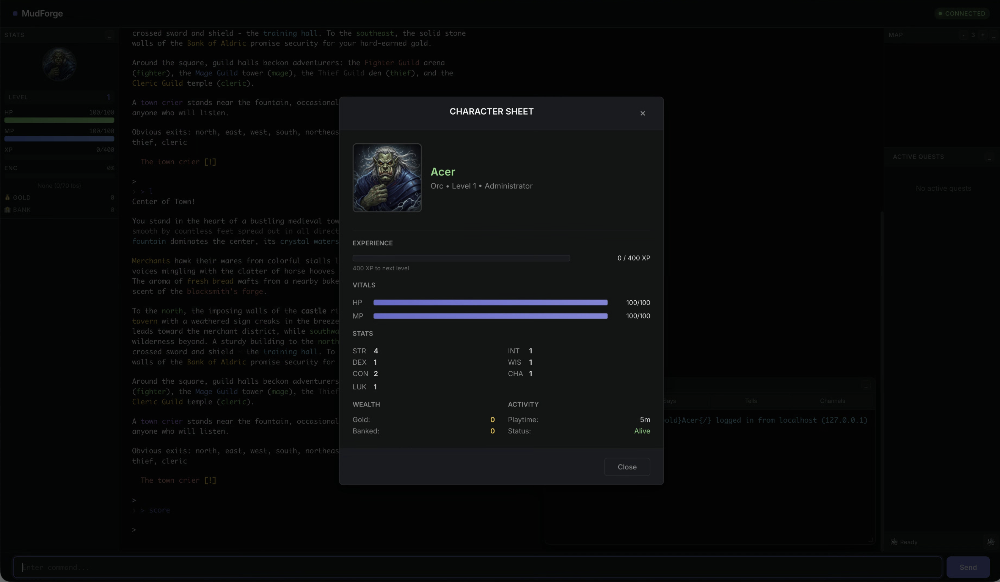
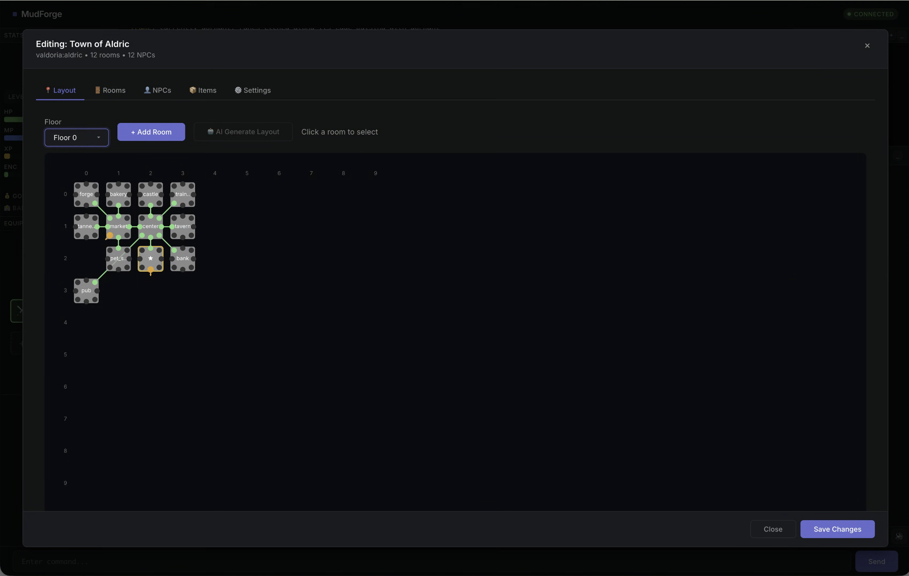

# MudForge

<p align="center">
  
</p>

<p align="center">
  <a href="https://deepwiki.com/jasona/mudforge"></a>
</p>

A modern MUD (Multi-User Dungeon) driver inspired by LDMud, built with Node.js and TypeScript. Write game content in TypeScript, hot-reload it without restarts, and connect players through a browser-based web client.

## Highlights

- **TypeScript everywhere** - Game content, driver, and client all in TypeScript with full type safety
- **Runtime hot-reload** - Modify rooms, NPCs, and commands while the game is running
- **Browser-based client** - Dark-themed web UI with stats panel, minimap, quest tracker, and sound
- **AI-powered NPCs** - Dynamic dialogue, content generation, and worldbuilding via Claude AI
- **Rich game systems** - Combat, guilds, quests, professions, pets, mercenaries, vehicles, and more
- **Pluggable persistence** - Filesystem (default) or Supabase cloud storage
- **External integrations** - Discord bridge, Giphy, Intermud 3/2, Grapevine cross-MUD network

## Screenshots

<p align="center">
  
</p>
<p align="center"><em>Modern dark-themed login interface</em></p>

<p align="center">
  
</p>
<p align="center"><em>Character score with stats, equipment, and guild information</em></p>

<p align="center">
  
</p>
<p align="center"><em>Visual area builder for creating game content</em></p>

## Quick Start

```bash
git clone https://github.com/jasona/mudforge.git
cd mudforge
npm install
npm run dev
```

Open [http://localhost:3000](http://localhost:3000) in your browser and create a character.

## Technology Stack

| Component | Technology |
|-----------|------------|
| Runtime | Node.js 22+ LTS |
| Language | TypeScript 5.x |
| WebSocket | ws |
| Web Server | Fastify |
| Client Editor | CodeMirror 6 |
| Compilation | tsx (runtime), esbuild (client) |
| Testing | Vitest |

## Documentation

Full documentation lives in the [`/docs`](docs/README.md) directory, organized into sections for players, builders, admins, and engine internals. Start here:

- **[Getting Started](docs/getting-started.md)** - Installation, configuration, and first steps
- **[Architecture](docs/architecture.md)** - How the driver and mudlib work together
- **[Mudlib Guide](docs/mudlib-guide.md)** - Creating rooms, items, NPCs, and game content
- **[Commands Reference](docs/commands.md)** - All player, builder, and admin commands
- **[Efuns Reference](docs/efuns.md)** - Complete driver API (~55 functions)
- **[Deployment Guide](docs/deployment.md)** - Docker, PM2, environment variables, and production setup

Browse the **[full documentation index](docs/README.md)** for 65+ guides covering every system.

## Community

- **Discord**: [https://discord.gg/GEBatdTCYZ](https://discord.gg/GEBatdTCYZ) - Chat with developers and other MUD builders
- **GitHub Issues**: [Report bugs or request features](https://github.com/jasona/mudforge/issues)

## Inspiration

MudForge draws inspiration from [LDMud](https://github.com/ldmud/ldmud), the classic LPMud driver.

## License

MIT
