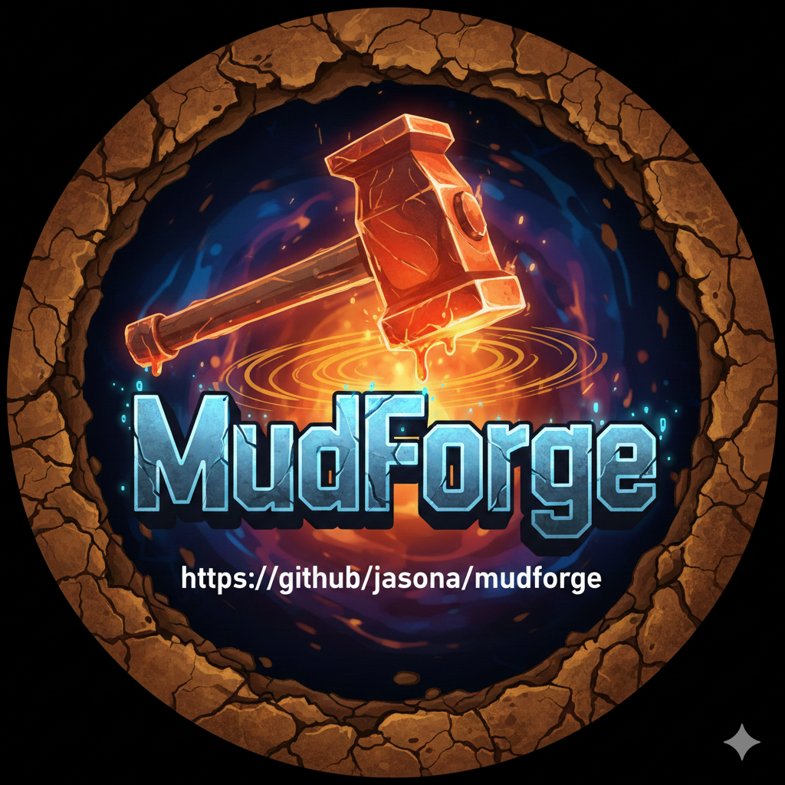

# MudForge

<p align="center">
  
</p>

A modern MUD (Multi-User Dungeon) driver inspired by LDMud, built with Node.js and TypeScript.

## Overview

MudForge brings the architectural elegance of classic LPMud drivers into the modern era. It replaces the traditional LPC scripting language with TypeScript, enables real-time in-game scripting without server restarts, and provides browser-based connectivity via WebSocket.

### Key Features

- **TypeScript Scripting** - Write game content in TypeScript with full IDE support, type safety, and modern syntax
- **Runtime Hot-Reload** - Create and modify objects while the game is running without server restarts
- **Modern Web Client** - Clean, Linear.app-inspired browser interface with dark theme and 256-color support
- **Graphical Stats Panel** - Floating, draggable HP/MP/XP/gold bars with real-time updates
- **Interactive Map Panel** - Floating, resizable map showing explored areas
- **LDMud-Inspired Architecture** - Everything is an object with consistent inheritance hierarchy
- **Multi-Guild System** - Join up to 3 guilds with skill trees, guild XP, and progression (Fighter, Mage, Thief, Cleric)
- **Quest System** - MMO-style quests with kill, fetch, deliver, escort, explore, and talk objectives
- **Buffs & Debuffs** - Temporary stat modifiers with stacking, duration, and visual indicators
- **Combat System** - Real-time combat with NPCs, death/resurrection, corpse looting, and wimpy auto-flee
- **Gold Economy** - Currency system with carrying gold, banking, giving, and dropping
- **Tiered Permission System** - Player, Builder, Senior Builder, and Administrator roles
- **Equipment System** - Weapons, armor, and shields with slot management and dual-wielding
- **Container System** - Chests, bags, and lockable containers
- **NPC System** - NPCs with combat AI, loot drops, autonomous behavior, quest giving, and training
- **Communication Channels** - OOC, shout, tell, guild channels, and extensible channel system
- **Command Aliases** - Player-defined command shortcuts and macro sequences
- **Session Reconnection** - Seamlessly reconnect to existing game sessions after disconnection
- **Link-Dead Handling** - Disconnected players fade to a holding area and auto-quit after configurable timeout
- **GUI Modal System** - Rich client-side dialogs for complex interactions
- **Memory Management** - Automatic object cleanup and garbage collection
- **Mud-Wide Configuration** - Persistent ConfigDaemon for game-wide settings adjustable by admins
- **File-Based Persistence** - Human-readable TypeScript/JSON files that work with version control

## Design Philosophy

Following LDMud's proven architecture, MudForge embraces the principle that **everything is an object**:

- **Consistency** - All objects respond to the same base protocols
- **Flexibility** - Any object can be extended, cloned, or replaced at runtime
- **Discoverability** - Builders learn one object model that applies everywhere
- **Hot-reloading** - Objects can be updated without restarting the driver

## Architecture

```
+-----------------------------------------------------------------+
|                        Web Browser                              |
|  +-----------------------------------------------------------+  |
|  |           Modern Web Client (Linear.app-inspired)         |  |
|  +-----------------------------------------------------------+  |
+-----------------------------------------------------------------+
                              | WebSocket
                              v
+-----------------------------------------------------------------+
|                     MUD Driver (Node.js)                        |
|  +-------------+  +-------------+  +-------------+              |
|  | Connection  |  |   Object    |  |  Scheduler  |              |
|  |  Manager    |  |  Registry   |  | (heartbeat) |              |
|  +-------------+  +-------------+  +-------------+              |
|  +-----------------------------------------------------------+  |
|  |                 Mudlib Execution Context                   |  |
|  |  +---------+  +-------------+  +---------------+           |  |
|  |  | Master  |  | Sim Efuns   |  | Object Pool   |           |  |
|  |  +---------+  +-------------+  +---------------+           |  |
|  +-----------------------------------------------------------+  |
+-----------------------------------------------------------------+
                              |
                              v
+-----------------------------------------------------------------+
|                      File System (Mudlib)                       |
|  /mudlib/                                                       |
|  +-- master.ts              # Master object                     |
|  +-- efuns.d.ts             # Global efun type declarations     |
|  +-- std/                   # Standard library                  |
|  |   +-- room.ts, living.ts, player.ts, item.ts, ...           |
|  |   +-- weapon.ts, armor.ts, container.ts, npc.ts             |
|  +-- areas/                 # Game world content                |
|  +-- data/                  # Persistent state (JSON)           |
+-----------------------------------------------------------------+
```

## Object Hierarchy

```
MudObject                          # Root of all objects
+-- Master                         # World bootstrap, global hooks
+-- Room                           # Locations
+-- Item                           # Carryable objects
|   +-- Weapon                     # Melee/ranged weapons with handedness
|   +-- Armor                      # Body slot armor and shields
|   +-- Container                  # Chests, bags (openable, lockable)
|   |   +-- Corpse                 # Dead creatures (lootable)
|   +-- GoldPile                   # Dropped gold coins
+-- Living                         # Entities that can act
|   +-- Player                     # Human players with equipment, guilds, quests
|   +-- NPC                        # Computer-controlled characters
|   |   +-- Trainer                # NPCs that train stats/levels
|   |   +-- GuildMaster            # NPCs that manage guild membership
+-- Daemon                         # Background services
    +-- GuildDaemon                # Guild and skill management
    +-- QuestDaemon                # Quest registration and tracking
    +-- CombatDaemon               # Combat resolution
    +-- ChannelDaemon              # Communication channels
    +-- SoulDaemon                 # Emote management
    +-- ResetDaemon                # Periodic room resets
    +-- ConfigDaemon               # Game-wide configuration
```

## Technology Stack

| Component | Technology |
|-----------|------------|
| Runtime | Node.js 22+ LTS |
| Language | TypeScript 5.x |
| WebSocket | ws |
| Web Server | Fastify |
| Compilation | tsx (runtime), esbuild (client) |
| Testing | Vitest |

## Getting Started

### Prerequisites

- **Node.js 20+** (LTS recommended)
- **npm** (comes with Node.js)

### Installation

```bash
# Clone the repository
git clone https://github.com/jasona/mudforge.git
cd mudforge

# Install dependencies
npm install

# Copy environment configuration (optional - defaults work fine)
cp .env.example .env
```

### Starting the Server

```bash
# Development mode (with hot-reload and auto-restart)
npm run dev

# Or for production
npm run build
npm start
```

You should see output like:
```
[INFO] MudForge Driver starting...
[INFO] Loading mudlib from ./mudlib
[INFO] WebSocket server listening on http://localhost:3000
```

### Connecting to the Game

1. **Open your web browser** and go to:
   ```
   http://localhost:3000
   ```

2. **The web client loads automatically** - you'll see a modern dark-themed terminal interface

3. **Create a new character** or log in:
   - Enter a character name when prompted
   - If the name is new, you'll be guided through character creation
   - If returning, enter your password

That's it! You're now connected to the MUD.

### Default Configuration

| Setting | Default | Description |
|---------|---------|-------------|
| Port | `3000` | HTTP/WebSocket server port |
| Host | `0.0.0.0` | Bind address (all interfaces) |
| Mudlib Path | `./mudlib` | Game content directory |

To change these, edit `.env` or set environment variables:
```bash
PORT=8080 npm run dev
```

### Development Commands

```bash
npm run dev        # Start with hot-reload (recommended for development)
npm run build      # Compile TypeScript to JavaScript
npm start          # Run compiled production build
npm test           # Run test suite
npm run lint       # Check code style
npm run typecheck  # TypeScript type checking
```

## Project Structure

```
src/
+-- driver/           # Core driver implementation
|   +-- driver.ts            # Main orchestrator
|   +-- object-registry.ts   # Object management
|   +-- scheduler.ts         # Heartbeat and call_out
|   +-- efun-bridge.ts       # Efuns exposed to mudlib
|   +-- command-manager.ts   # Command routing with hot-reload
|   +-- permissions.ts       # Permission system
|   +-- persistence/         # Save/load system
+-- network/          # WebSocket server
+-- client/           # Web client UI (Linear.app-inspired)

mudlib/
+-- master.ts         # Master object
+-- simul_efun.ts     # Simulated efuns
+-- efuns.d.ts        # Global efun type declarations
+-- tsconfig.json     # Mudlib TypeScript config
+-- std/              # Standard library
|   +-- object.ts, room.ts, living.ts, player.ts
|   +-- item.ts, weapon.ts, armor.ts, container.ts
|   +-- npc.ts, equipment.ts, trainer.ts
|   +-- combat/       # Combat system types and utilities
|   +-- guild/        # Guild system types and definitions
|   +-- quest/        # Quest system types and definitions
+-- daemons/          # Background services
|   +-- login.ts, channels.ts, combat.ts, config.ts
|   +-- guild.ts, quest.ts, soul.ts, reset.ts
+-- cmds/             # Player commands
|   +-- player/       # Commands for all players
|   +-- builder/      # Builder-only commands
|   +-- admin/        # Admin-only commands
+-- areas/            # Game world
|   +-- valdoria/     # Valdoria continent
|   +-- guilds/       # Guild halls
+-- data/             # Persistent state
+-- lib/              # Utility libraries

docs/                 # Documentation
tests/                # Test suite
```

## Player Features

### Item Interaction

```
get sword                    # Pick up an item
get all                      # Pick up all items
get sword from chest         # Get item from container
get gold                     # Pick up gold coins
drop sword                   # Drop an item
drop sword in chest          # Put item in container
drop gold                    # Drop all your gold
drop 50 gold                 # Drop specific amount
give sword to bob            # Give item to player/NPC
give 100 gold to bob         # Give gold to someone
open chest                   # Open a container
close chest                  # Close a container
look in chest                # See container contents
```

### Equipment System

```
wield sword                  # Wield a weapon
wield dagger in left         # Dual-wield (off-hand)
unwield                      # Unwield all weapons
wear armor                   # Wear armor
remove armor                 # Remove armor
equipment                    # View all equipped items
```

### Combat

```
kill goblin                  # Attack an NPC
flee                         # Attempt to escape combat
consider goblin              # Assess NPC difficulty
wimpy 20                     # Auto-flee at 20% health
```

When defeated, players become ghosts and can `resurrect` at the resurrection point. Your corpse remains at the death location with your carried gold - return to loot it!

### Guilds & Skills

Join up to 3 guilds simultaneously and learn unique skills:

```
guild list                   # See all available guilds
guild info fighter           # Learn about a specific guild
guild join fighter           # Join a guild (must meet requirements)
guild leave fighter          # Leave a guild
skills                       # View your learned skills
skill use bash goblin        # Use an active skill
bash goblin                  # Shorthand for learned skills
advance                      # See advancement options
advance fighter              # Advance guild level (costs guild XP)
advance bash                  # Advance skill level (costs player XP)
```

**Starter Guilds**: Fighter (melee combat), Mage (arcane magic), Thief (stealth & precision), Cleric (healing & divine power)

### Quests

Accept and complete quests for XP, gold, and quest points:

```
quest                        # Show active quests
quest log                    # Full quest log with progress
quest info <name>            # Detailed quest information
quest accept                 # See available quests from nearby NPCs
quest accept <name>          # Accept a specific quest
quest abandon <name>         # Abandon an active quest
quest turn-in <name>         # Turn in a completed quest
quest history                # View completed quests
quest points                 # Check quest point balance
```

Quest types include: kill targets, collect items, deliver packages, escort NPCs, explore locations, and talk to characters.

### Buffs & Debuffs

Temporary effects that modify your stats:

```
buffs                        # View active buffs and debuffs
```

Effects can come from skills, potions, equipment, or environmental sources. Multiple effects of the same type stack, and durations are tracked automatically.

### Gold & Economy

```
score                        # See your gold (carried and banked)
get gold from corpse         # Loot gold from defeated enemies
drop 100 gold                # Drop gold on the ground
give 50 gold to merchant     # Give gold to NPCs/players
```

Banks in towns allow you to safely store gold that won't be lost on death.

### Custom Display Names

Players can create colorful, personalized display names:

```
displayname Sir {blue}$N{/} the {green}Bold{/}
```

- Use `$N` as a placeholder for your actual name
- Use color codes like `{red}`, `{blue}`, `{green}`, `{bold}`, `{/}` (reset)
- Display names appear in room descriptions and the who list

### Communication

```
say <message>                # Talk to players in the same room
tell <player> <message>      # Private message to a player
reply <message>              # Reply to last tell
shout <message>              # Broadcast to all players
ooc <message>                # Out-of-character chat channel
fighter <message>            # Guild channel (if member)
emote <action>               # Perform an emote
emote smile at bob           # Target someone with an emote
remote bob wave              # Emote at someone in another room
```

### Command Aliases & Macros

Create shortcuts for frequently used commands:

```
alias                        # View all aliases
alias k kill                 # Create alias 'k' for 'kill'
alias atk kill $*            # Alias with arguments
unalias k                    # Remove an alias
do n;n;e;get sword           # Execute multiple commands
```

### Session Reconnection & Link-Dead Handling

If you disconnect unexpectedly:
- Your character's form "fades from view" and is moved to a holding area
- Other players in the room see a message about your departure
- You have a configurable timeout (default 15 minutes) to reconnect
- When you reconnect, you "shimmer back into existence" at your original location
- If you don't reconnect in time, your character is automatically saved and logged out

Simply reconnect and log back in to resume your session.

## User Roles

| Role | Capabilities |
|------|-------------|
| **Player** | Connect, play the game, customize display name, manage personal `settings` |
| **Builder** | Create/modify objects in assigned domains, `goto` (players or rooms), file commands |
| **Senior Builder** | Cross-domain building, advanced APIs |
| **Administrator** | Full access, permission management, mud-wide `config`, reload objects |

## Example: Creating a Room

```typescript
// /mudlib/areas/town/tavern.ts
import { Room } from '../../std/room.js';

export class Tavern extends Room {
  constructor() {
    super();
    this.shortDesc = 'The Rusty Tankard';
    this.longDesc = `You stand in a cozy tavern. A fire crackles in the hearth,
and the smell of roasting meat fills the air.`;
  }

  override async onCreate(): Promise<void> {
    await super.onCreate();
    this.addExit('south', '/areas/town/market');
    this.addAction('order', this.handleOrder.bind(this));
  }

  private handleOrder(args: string): boolean {
    const player = efuns.thisPlayer();
    if (!player) return false;
    efuns.send(player, 'The bartender pours you a frothy ale.');
    return true;
  }
}
```

## Example: Creating an NPC

```typescript
// /mudlib/areas/town/town_crier.ts
import { NPC } from '../../std/npc.js';

export class TownCrier extends NPC {
  constructor() {
    super();
    this.setNPC({
      name: 'town crier',
      shortDesc: 'the town crier',
      longDesc: 'A stout man in a faded blue coat with a brass bell.',
      chatChance: 15, // 15% chance per heartbeat to chat
    });

    // Periodic announcements
    this.addChat('Hear ye, hear ye! The castle seeks adventurers!', 'say');
    this.addChat('rings his brass bell loudly.', 'emote');

    // Response triggers
    this.addResponse(/hello|hi/i, 'Good day to you, traveler!', 'say');
    this.addResponse(/news/i, 'The castle has posted new bounties!', 'say');
  }
}
```

## Global Efuns Type Declarations

MudForge provides global type declarations for all efuns via `mudlib/efuns.d.ts`. This means you don't need to declare efuns at the top of every file - they're automatically available:

```typescript
// No need for "declare const efuns" - it's globally available!
export class MyRoom extends Room {
  async onCreate(): Promise<void> {
    const sword = await efuns.cloneObject('/std/sword');
    await sword?.moveTo(this);
  }
}
```

## Documentation

Detailed documentation is available in the `/docs` directory:

- [Architecture](docs/architecture.md) - System design and components
- [Mudlib Guide](docs/mudlib-guide.md) - Creating game content
- [Efuns Reference](docs/efuns.md) - Driver API functions
- [Commands](docs/commands.md) - Command reference
- [Player Features](docs/player-features.md) - Display names, channels, who list
- [Guilds](docs/guilds.md) - Multi-guild system with skills and progression
- [Quests](docs/quests.md) - Quest system with objectives and rewards
- [Buffs & Debuffs](docs/buffs-debuffs.md) - Temporary stat modifiers
- [Colors](docs/colors.md) - Color codes and 256-color support
- [Daemons](docs/daemons.md) - Background services
- [Permissions](docs/permissions.md) - Permission system
- [Web Client](docs/client.md) - Browser client documentation
- [GUI Modals](docs/gui-modals.md) - Rich client-side dialogs
- [Memory Management](docs/memory-management.md) - Object cleanup system
- [Deployment](docs/deployment.md) - Production deployment

## Deployment

### Docker

```bash
docker build -t mudforge .
docker run -p 3000:3000 mudforge
```

### PM2

```bash
pm2 start ecosystem.config.js
```

## Status

This project is under active development. See [tasks/tasks-modern-mud-driver.md](tasks/tasks-modern-mud-driver.md) for the implementation roadmap.

## Inspiration

MudForge draws inspiration from:
- [LDMud](https://github.com/ldmud/ldmud) - The classic LPMud driver

## License

MIT
